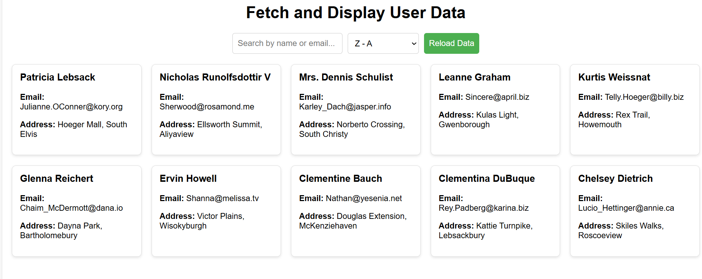
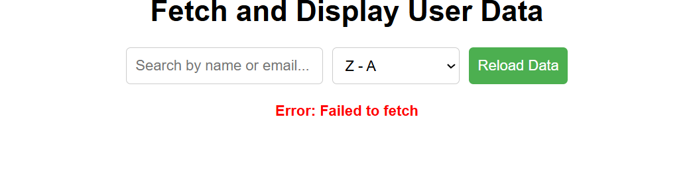

##Fetch and Display User Data:
A simple front-end project demonstrating how to fetch, display, search, sort, and reload user data from a public API using the JavaScript Fetch API.

🔍 Table of Contents
Features
Demo
Getting Started
.Prerequisites
.Installation
.Running the Project
Usage
Project Structure
Technologies Used
API Source
Future Enhancements
Contributing
License

🎯 Features

Fetch API: Retrieve user data asynchronously.
Loading Spinner: Visual feedback during data loading.
Live Search: Filter users by name or email (case-insensitive).
Sorting: Sort user list alphabetically (A–Z and Z–A).
Reload Button: Refetch data on demand.
Error Handling: Gracefully handle network errors.
Responsive UI: Card-based layout that adapts to different screen sizes.

📸 Demo

| INTERNET | NO INTERNET |
|------------|----------------|
|  |  |

🚀 Getting Started

Follow these instructions to get a copy of the project up and running on your local machine.

.Prerequisites
Modern web browser (Chrome, Firefox, Edge, Safari)
VS Code or any code editor
Internet connection (to fetch API data)

.Installation
1. Clone the repository
git clone https://github.com/your-username/fetch-user-data.git
cd fetch-user-data
2. Open the project in your code editor.

.Running the Project
1. Start a local server (optional but recommended for CORS safety). For example, using VS Code Live Server extension or Python's built-in server:
# Python 3.x
python -m http.server 8000
2. Open your browser and navigate to:
http://localhost:8000/index.html
3. Interact with the app:
View user cards loaded from the public API
Search users by name or email
Sort users A–Z or Z–A
Reload data using the button

📦 Project Structure
fetch-user-data/
├── data display.html  # Main HTML page containing CSS and JavaScript(fetch,search,sort)
├── README.md       	 # Project documentation
└── demo.png          # Screenshot for README

🛠 Technologies Used

1.HTML5 & CSS3
2.JavaScript (ES6+)
3.Fetch API
4.JSONPlaceholder (online REST API)

🌐 API Source

Data is fetched from JSONPlaceholder:

> https://jsonplaceholder.typicode.com/users

> JSONPlaceholder is a free, fake REST API for testing and prototyping.

🔮 Future Enhancements

Pagination or infinite scroll
Export data as CSV or JSON
Theme switcher (light/dark mode)
Unit tests with Jest

🤝 Contributing

1. Fork the repository
2. Create your feature branch: git checkout -b feature/YourFeature
3. Commit your changes: git commit -m 'Add YourFeature'
4. Push to the branch: git push origin feature/YourFeature
5. Open a Pull Request

📝 License

This project is licensed under the MIT License.

**Happy coding!**
